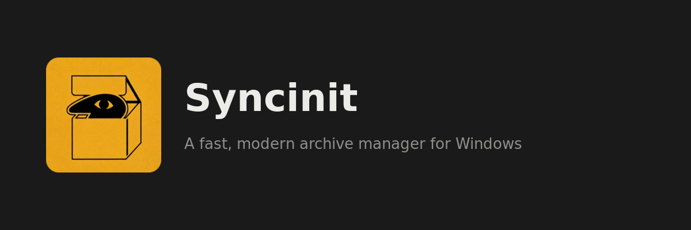

  

<em>A fast, modern archive manager for Windows — a practical WinRAR alternative.</em>

---

Syncinit reads and writes `.init` (its own branded, ZIP-compatible format),
`.zip`, `.tar` and its compressed variants, and reads `.7z`. It integrates
into the Windows Explorer right-click menu, supports AES-256 PIN
protection, and ships with no telemetry and no network calls.

## Supported formats

- Read/extract: `.init`, `.zip`, `.tar`, `.tar.gz`/`.tgz`, `.tar.xz`/`.txz`,
  `.tar.zst`, `.tar.bz2`/`.tbz2`, and `.7z`
- Create: `.init`, `.zip`, `.tar`, `.tar.gz`, and `.tar.zst`

Syncinit does not create proprietary `.rar` files. `.init` is the branded,
ZIP-compatible alternative — readable by Syncinit, and by any ZIP tool that
checks file signatures rather than trusting the extension.

## Download

Get the latest Windows installer from the
[Releases page](https://github.com/Wooinxlkz/Syncinit/releases). Run the
installer and Syncinit adds itself to the Explorer right-click menu
automatically — no separate setup step.

Full version history: [RELEASES.md](RELEASES.md)

## Security & privacy

- AES-256 encryption (real AES, not legacy ZipCrypto) for password/PIN-protected archives
- No telemetry, no analytics, no network calls of any kind
- See [PRIVACY.md](PRIVACY.md) for the full policy

## License

Syncinit is proprietary software — see [LICENSE](LICENSE). Free to download
and run; not free to copy, redistribute, or modify and re-release. Built
on open-source components, each under its own license — see
[THIRD-PARTY-NOTICES.md](THIRD-PARTY-NOTICES.md).

## Support

Syncinit is free. If you find it useful, a donation link may be here —
purely optional, nothing is gated behind it.
